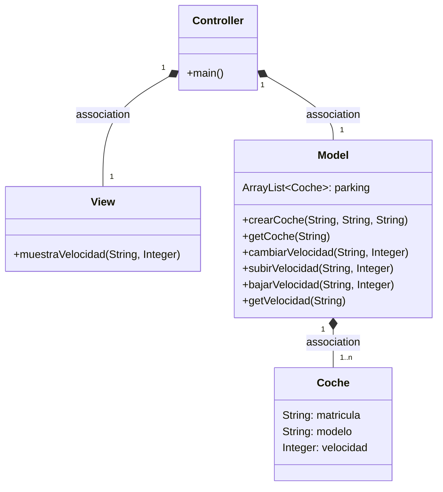
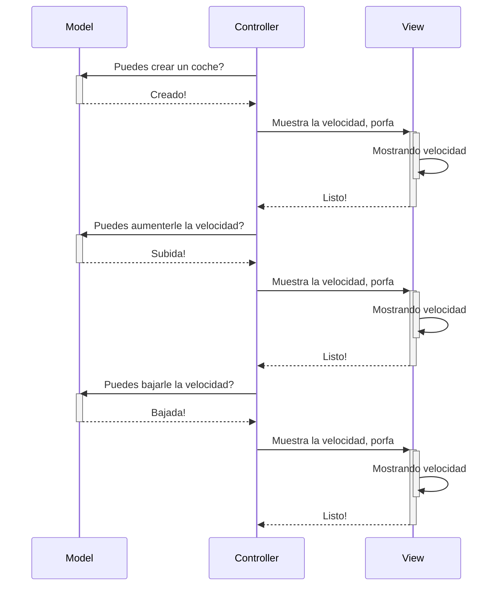
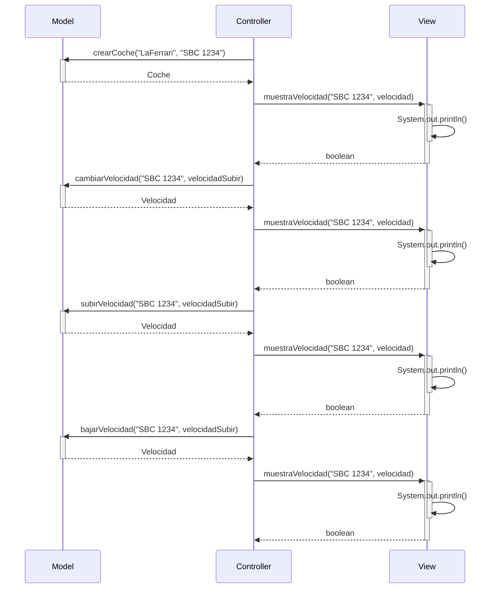

# Examen 
Creamos la rama con el comando git checkout -b ex3 y le implementamos la funcionalidad de buscar un coche 
dado de alta y mostrar sus datos incluyendo la velocidad. Para hacer esto en la clase controller añadimos
un nuevo bloque de codigo para mostrar los datos del coche. busca un coche en el modelo utilizando la matrícula especificada ("SBC 1234"). 
Si se encuentra un coche con esa matrícula, se imprimen en la consola sus datos, incluyendo la velocidad. 
En caso de no encontrar un coche con esa matrícula, se muestra un mensaje indicando que no se encontró ningún coche.
Y en clase Model se agregó el método getCoche el cual nos permite obtener un objeto Coche a partir de su matricula

# Arquitectura MVC

Aplicación que trabaja con objetos coches, modifica la velocidad y la muestra

---

## Diagrama de clases:

---

## Diagrama de Secuencia

Ejemplo básico del procedimiento, sin utilizar los nombres de los métodos

El mismo diagrama con los nombres de los métodos:

