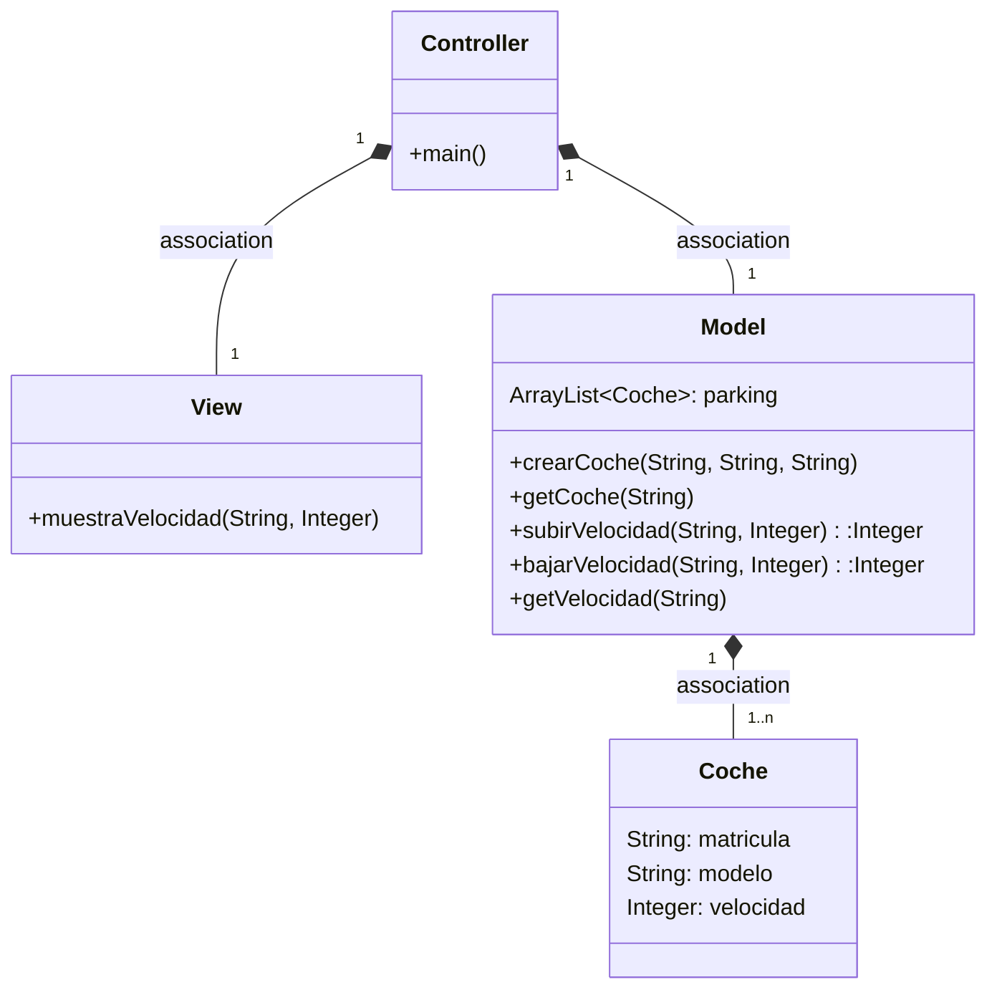
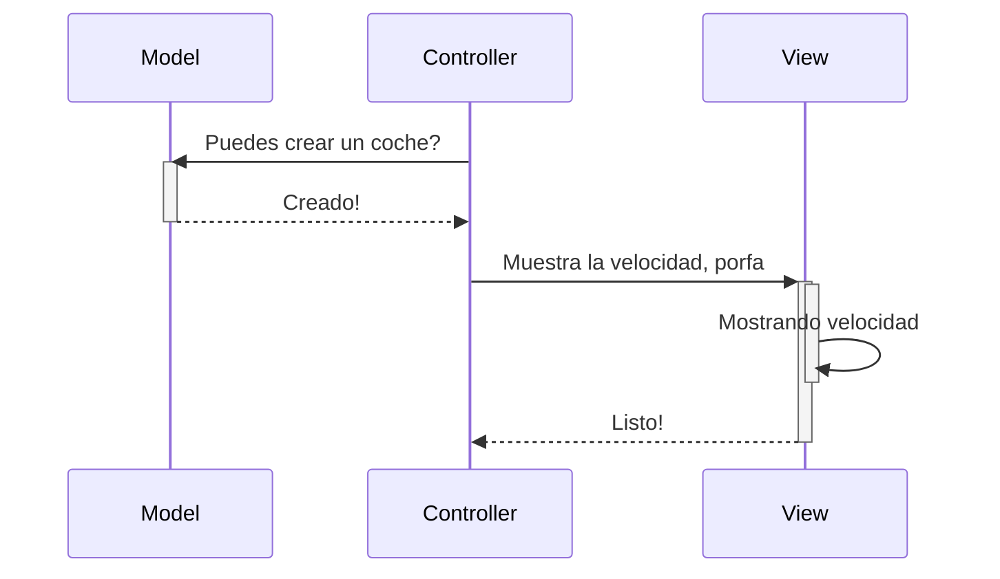
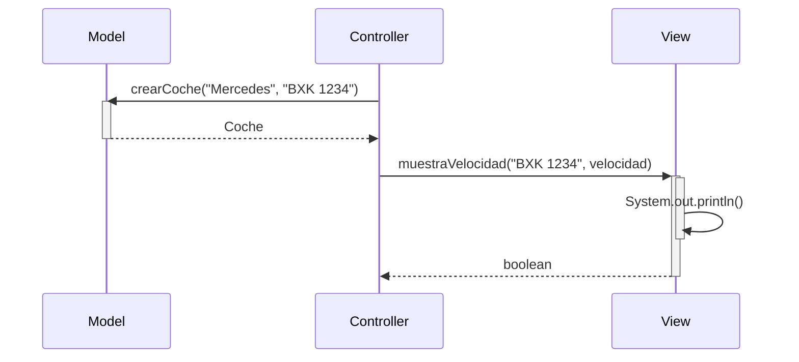
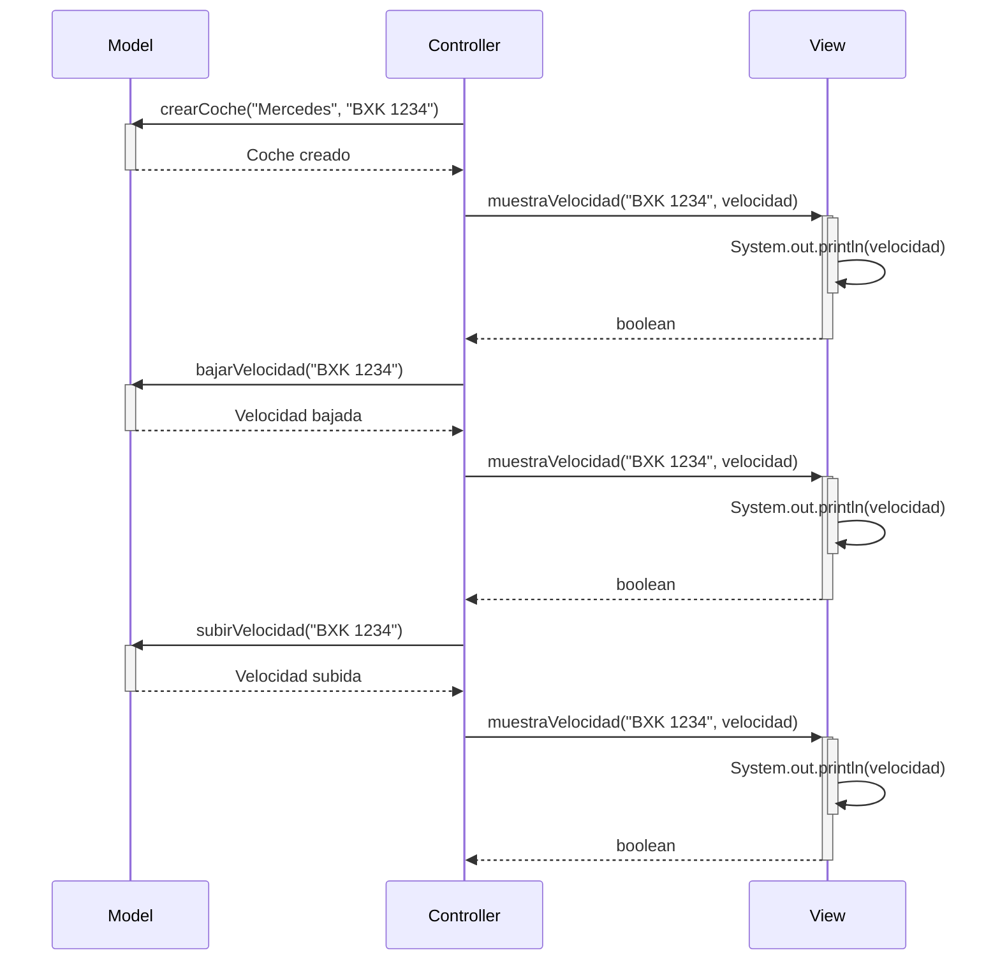

# Arquitectura MVC

Aplicación que trabaja con objetos coches, modifica la velocidad y la muestra

### ejercicios

Crea tu rama de desarrollo
Realiza una modificación que en vez de cambiar la velocidad, haya dos métodos:
subirVelocidad(String matricula, Integer v), sube la velocidad en 'v' unidades
bajarVelocidad(String matricula, Integer v), baja la velocidad en 'v' unidades
Modifica el diagrama de clases y secuencia
realiza un pull request al repositorio original

SUBIR Y BAJAR
---
EL PROXIMO cambio realizado son dos metodos de subir y bajar velocidad, para esto en la Interfaz de Usuario,
añadimos dos botones uno de subir la velocidad en 10kmh y otro par abajar la velocidad en 10kmh

---
## Diagrama de clases:

---

## Diagrama de Secuencia

Ejemplo básico del procedimiento, sin utilizar los nombres de los métodos

El mismo diagrama con los nombres de los métodos

## BAJAR Y SUBIR VELOCIDAD

