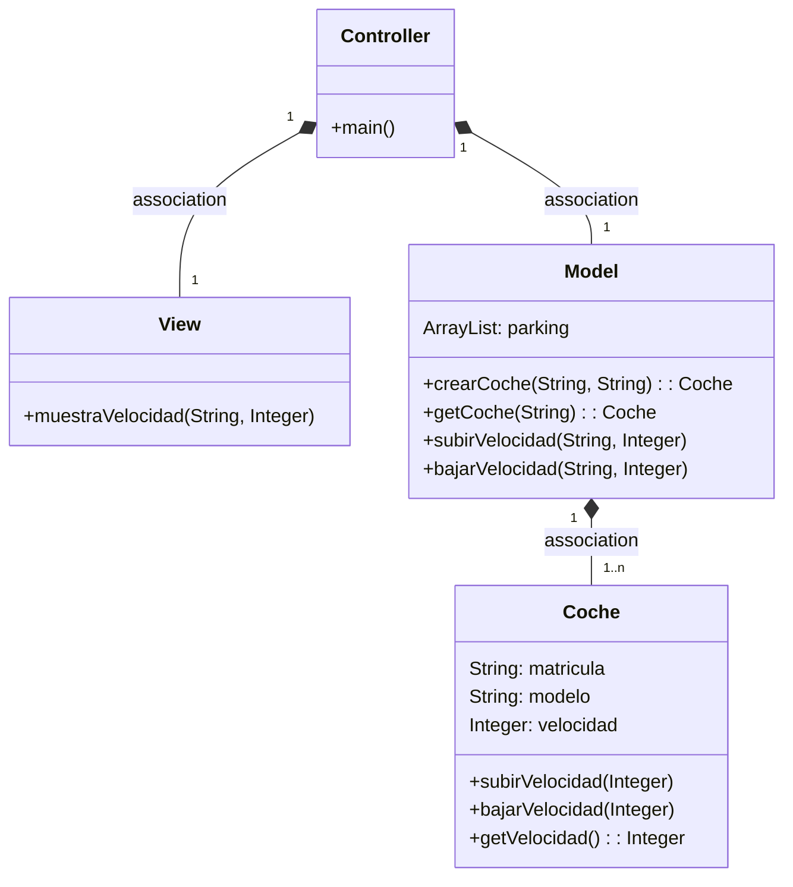
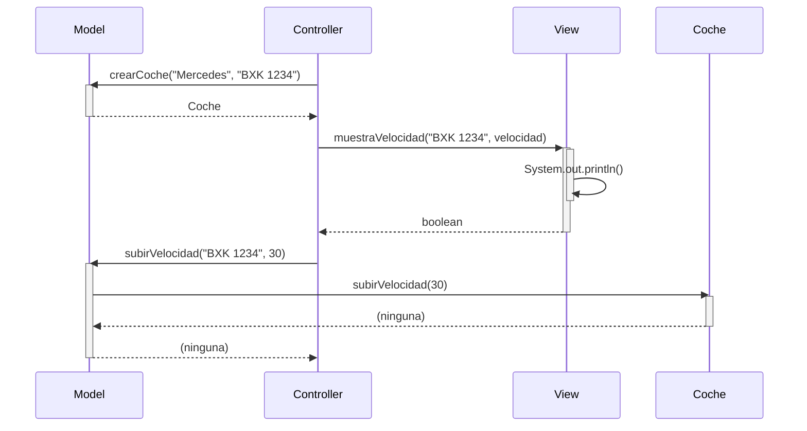

Proyecto MVC Coches:
*los cambios del segundo examen de la 3ª - límite de velocidad con ovserver están más abajo*
------------------------------------------------------------------------------------------------------------------------------------------------
Proyecto MVC Coches! En este proyecto he implementado una arquitectura Modelo-Vista-Controlador (MVC) para administrar coches y sus velocidades.

Funcionalidades implementadas
------------------------------------------------------------------------------------------------------------------------------------------------
Subir y bajar velocidad
He añadido la funcionalidad de subir y bajar la velocidad de los coches. Cada coche tiene un modelo, una matrícula y una velocidad asociada. Utilizando la lógica del controlador, ahora puedo aumentar o disminuir la velocidad de un coche específico en incrementos dados.

Búsqueda de coche y visualización de datos
------------------------------------------------------------------------------------------------------------------------------------------------
También he implementado la capacidad de buscar un coche dado de alta y mostrar sus datos completos, incluyendo la velocidad. A través del modelo, puedo buscar un coche por su matrícula y, si se encuentra, obtener su información completa y mostrarla en la vista correspondiente.

 Arquitectura MVC
------------------------------------------------------------------------------------------------------------------------------------------------
Aplicación que trabaja con objetos coches, modifica la velocidad y la muestra

------------------------------------------------------------------------------------------------------------------------------------------------
# Examen 3ªEVA V2 - Observer
Este proyecto implementa un sistema de gestión de coches utilizando el patrón MVC (Modelo-Vista-Controlador).
------------------------------------------------------------------------------------------------------------------------------------------------

Cambios para implementar un aviso de límite de velocidad mediante observer:
------------------------------------------------------------------------------------------------------------------------------------------------

## Pasos seguidos para implementar la funcionalidad de aviso de exceso de velocidad
1. Crear una nueva rama llamada `ex3observer` utilizando el comando:
git checkout -b ex3observer
------------------------------------------------------------------------------------------------------------------------------------------------

2. Editar el código para agregar la funcionalidad de aviso de exceso de velocidad:
- Se ha creado la clase `ObsExceso` que implementa la interfaz `Observer` para manejar el aviso de exceso de velocidad.
- En la clase `Coche`, se ha agregado el campo `observers` y se han implementado los métodos para añadir, eliminar y notificar a los observers cuando cambie la velocidad.
- En la clase `Model`, se ha actualizado el método `crearCoche` para registrar el observer `ObsExceso` al crear un nuevo coche.
------------------------------------------------------------------------------------------------------------------------------------------------

3. Subir los cambios a GitHub con los siguientes comandos:
git add .
git commit -m "Agrego el código para la función de exceso de velocidad"
git push origin ex3observer
------------------------------------------------------------------------------------------------------------------------------------------------

4. Crear un issue en GitHub para exponer los cambios:
- Título del issue: Implementación de aviso de exceso de velocidad utilizando Observer
- Descripción del issue: Se ha agregado la funcionalidad de aviso de exceso de velocidad utilizando el patrón Observer. Detalles en el pull request.
------------------------------------------------------------------------------------------------------------------------------------------------

5. Crear un pull request para fusionar los cambios en la rama principal:
- Descripción del pull request: Este pull request propone la incorporación de la funcionalidad de aviso de exceso de velocidad utilizando el patrón Observer. Los detalles de los cambios realizados se encuentran en el issue asociado.
-----------------------------------------------------------------------------------------------------------------------------------------------*

------------------------------------------------------------------------------------------------------------------------------------------------
## Diagrama de clases:

---

## Diagrama de Secuencia

Ejemplo básico del procedimiento, sin utilizar los nombres de los métodos

El mismo diagrama con los nombres de los métodos

