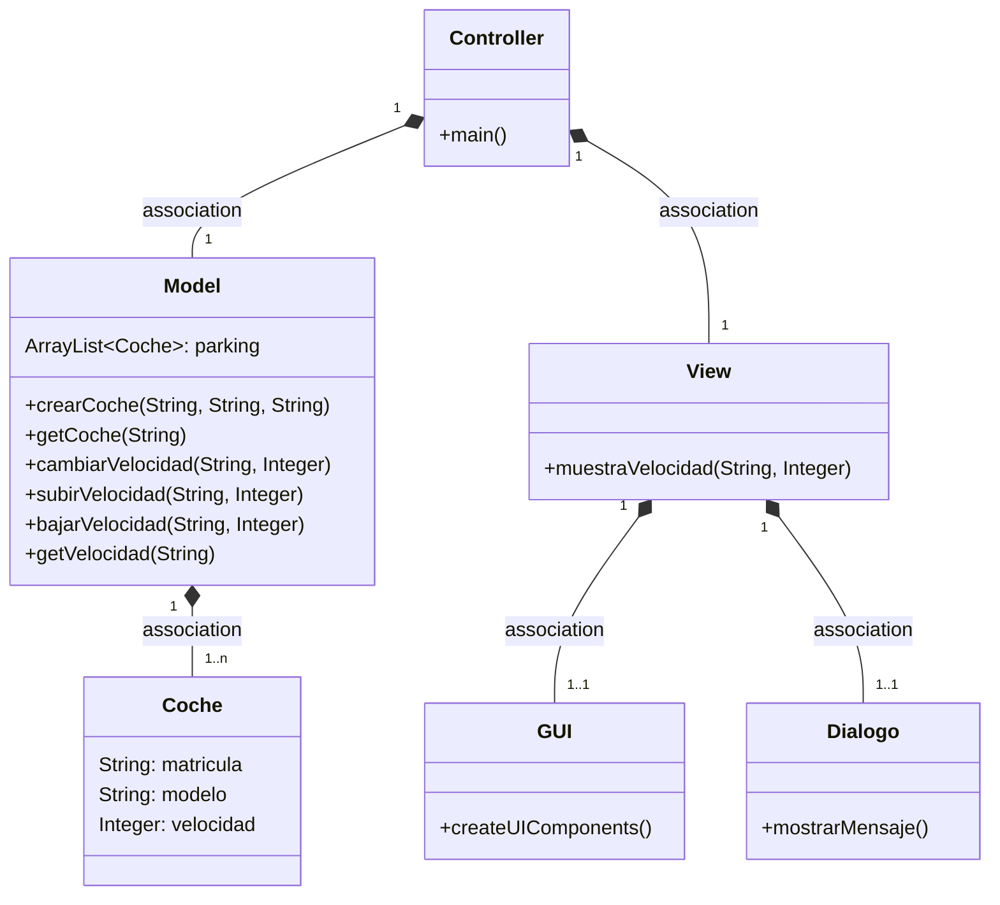
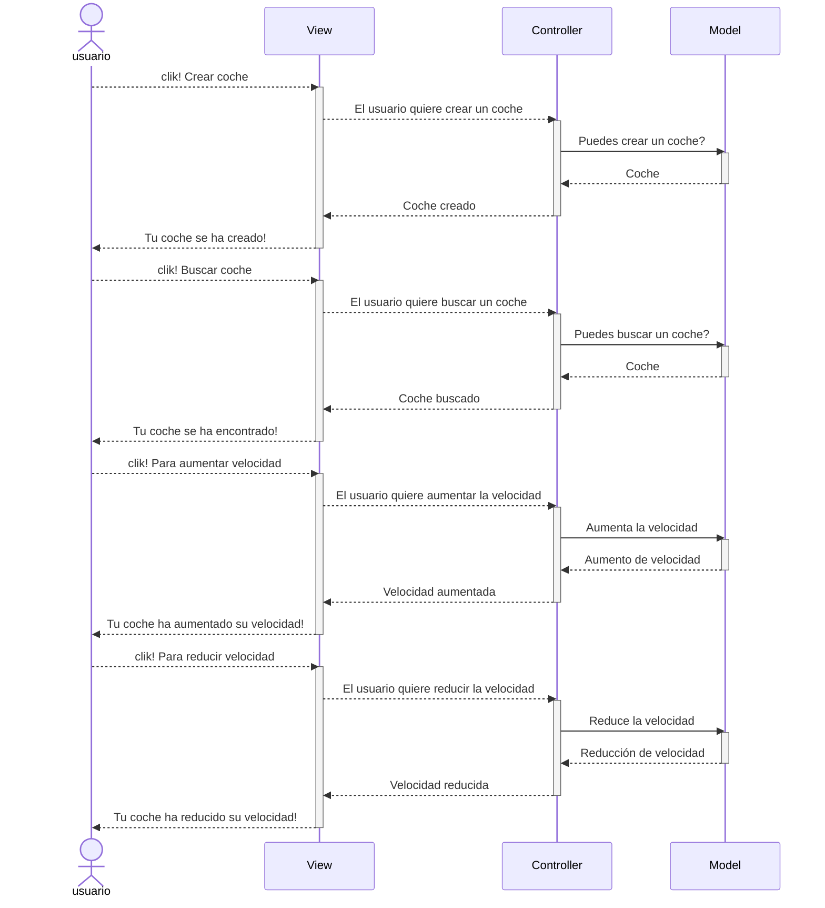
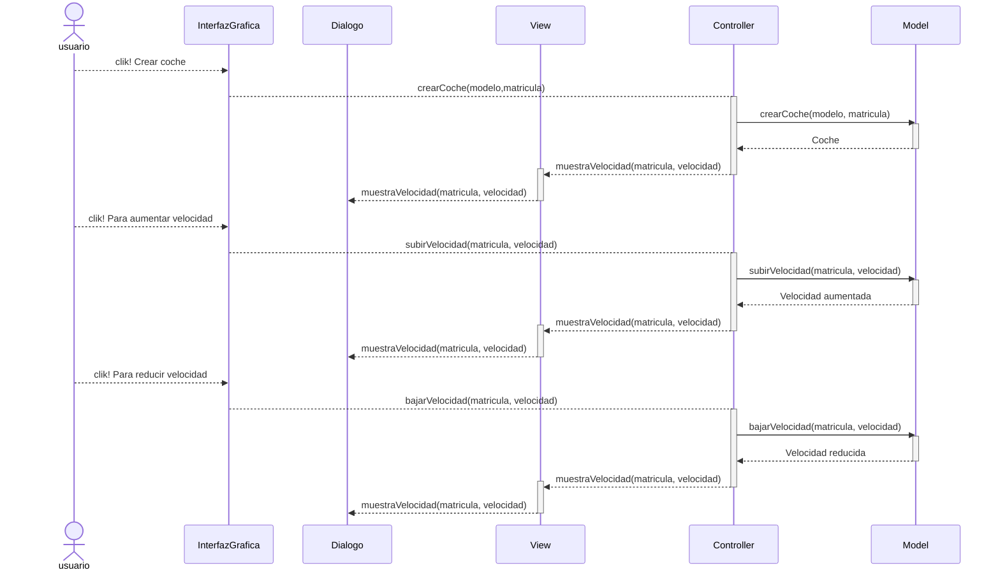

# Arquitectura MVC

Aplicación que trabaja con objetos coches, modifica la velocidad y la muestra

---
## Diagrama de clases:

---

## Diagrama de Secuencia
## Evento en el View

Cuando ocurre un evento en la vista, el `controller`se tiene que enterar. 
Tener en cuenta que en el MVC estricto, la vista no se comunica con el modelo.

En el listener del botón llamamos al `controler`

El mismo diagrama con los nombres de los métodos y ahora la parte de la Arquitectura de la vista son tres clases

