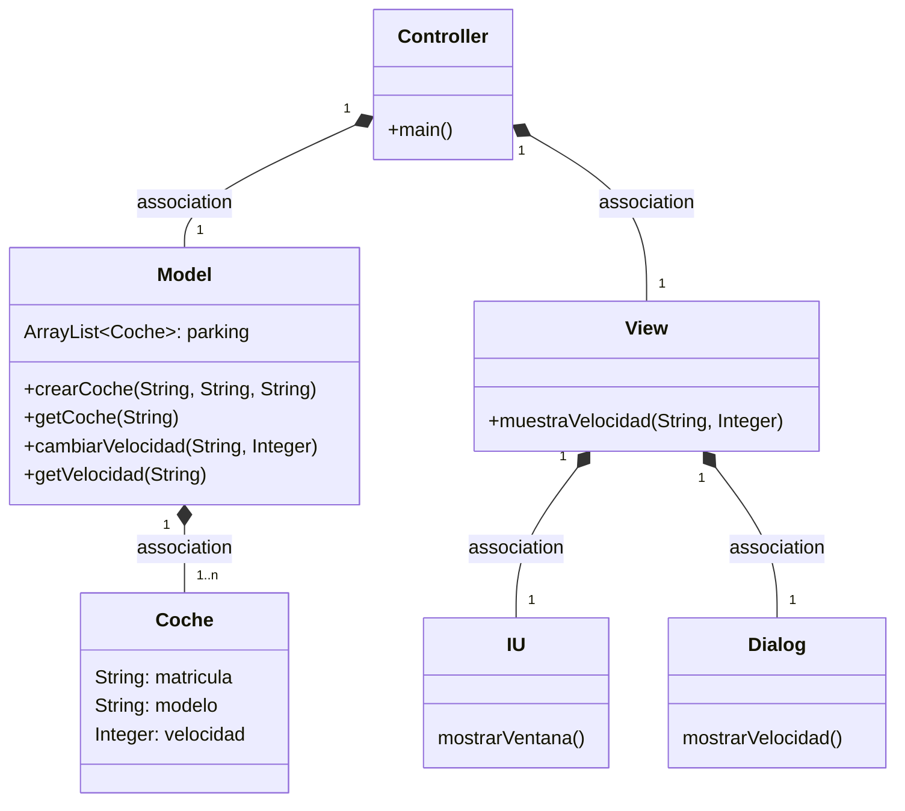
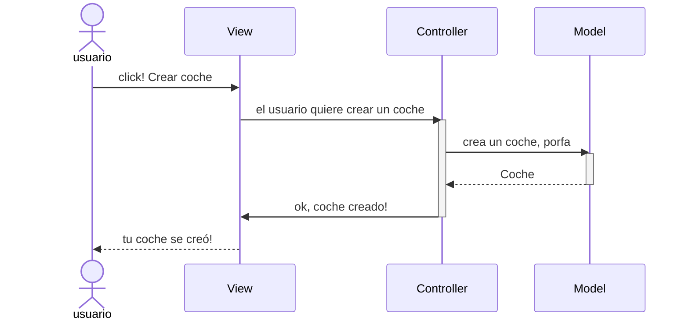
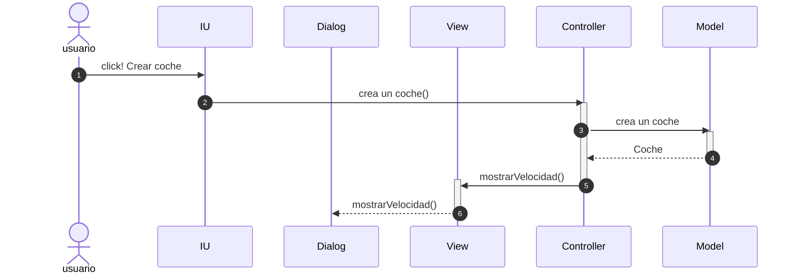
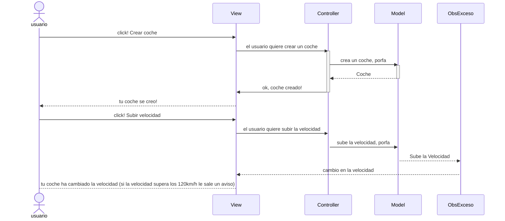
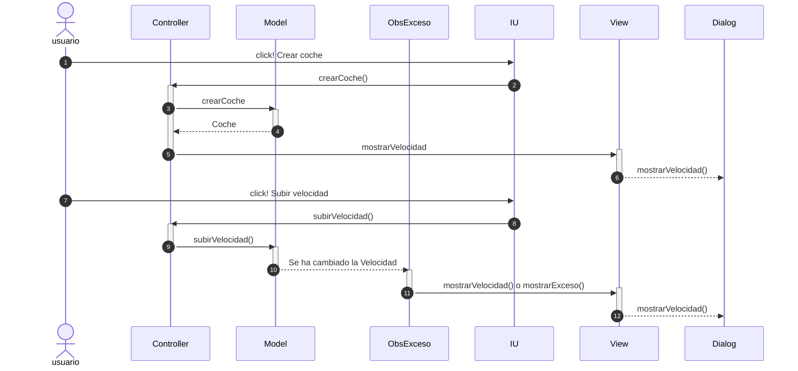

# Arquitectura MVC

Aplicación que trabaja con objetos coches, modifica la velocidad y la muestra

---

## Diagrama de clases:

---

## Evento en el View

Cuando ocurre un evento en la vista, el `controller` se tiene que enterar.
Tenemos que tener en cuenta que en el MVC estricto, la vista no se comunica con el modelo.

En el listener del botón llamamos al `controller`

 Arquitectura de la vista.

## Evento en la Vista con el Observer

---
## Evento con  Observer 

 En este diagrama explico de forma mas especifica.

