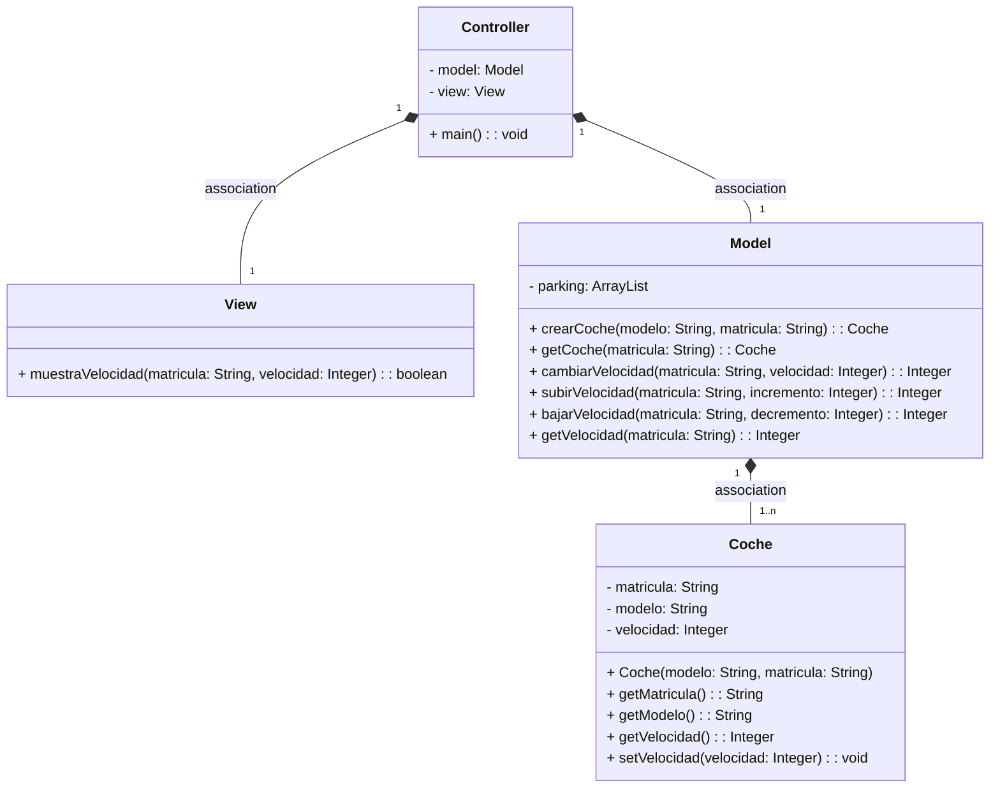
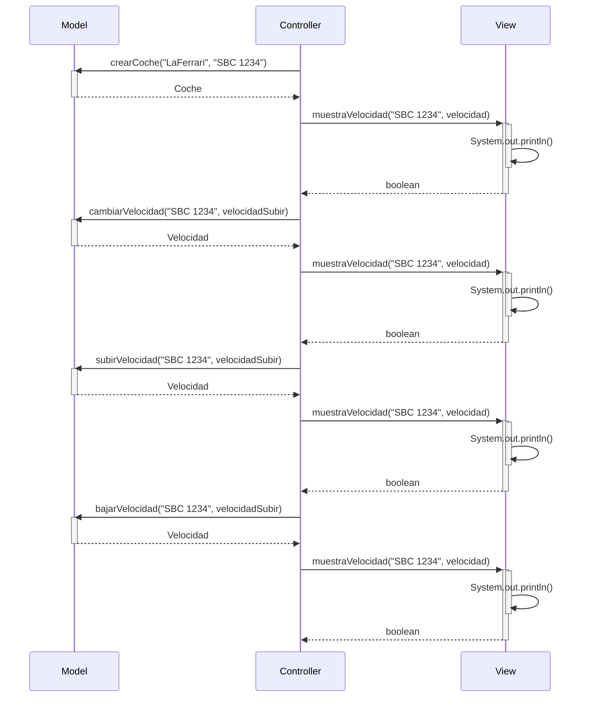

# Ex3observer 
Este proyecto implementa un sistema de control de velocidad de coches utilizando el patrón Observer en Java. 
El sistema permite crear coches, modificar su velocidad y mostrar la información del coche, incluyendo la velocidad.
Además, se ha añadido la funcionalidad de aviso de exceso de velocidad,
donde se muestra una alerta cuando la velocidad de un coche supera los 120 km/hr.

##Estructura del proyecto

Coche.java: Representa un coche con su matrícula, modelo y velocidad. La clase extiende Observable y notifica a los observadores cuando se actualiza la velocidad.

ObsExceso.java: Implementa la interfaz Observer y actúa como observador de los objetos Coche. Muestra una alerta cuando la velocidad de un coche supera los 120 km/hr.

Model.java: Contiene la lógica del sistema, como crear coches, modificar la velocidad y obtener información de los coches.

View.java: Proporciona métodos para mostrar información en la interfaz de usuario, en este caso, se utiliza para mostrar la velocidad de los coches.

Controller.java: Es la clase principal que inicializa el sistema, crea instancias de Model, View y los coches, y realiza acciones como modificar la velocidad y mostrar información.

# Examen 
Creamos la rama con el comando git checkout -b ex3 y le implementamos la funcionalidad de buscar un coche 
dado de alta y mostrar sus datos incluyendo la velocidad. Para hacer esto en la clase controller añadimos
un nuevo bloque de codigo para mostrar los datos del coche. busca un coche en el modelo utilizando la matrícula especificada ("SBC 1234"). 
Si se encuentra un coche con esa matrícula, se imprimen en la consola sus datos, incluyendo la velocidad. 
En caso de no encontrar un coche con esa matrícula, se muestra un mensaje indicando que no se encontró ningún coche.
Y en clase Model se agregó el método getCoche el cual nos permite obtener un objeto Coche a partir de su matricula

# Arquitectura MVC

Aplicación que trabaja con objetos coches, modifica la velocidad y la muestra

---

## Diagrama de clases:

---

## Diagrama de Secuencia

Ejemplo básico del procedimiento, sin utilizar los nombres de los métodos

El mismo diagrama con los nombres de los métodos:

