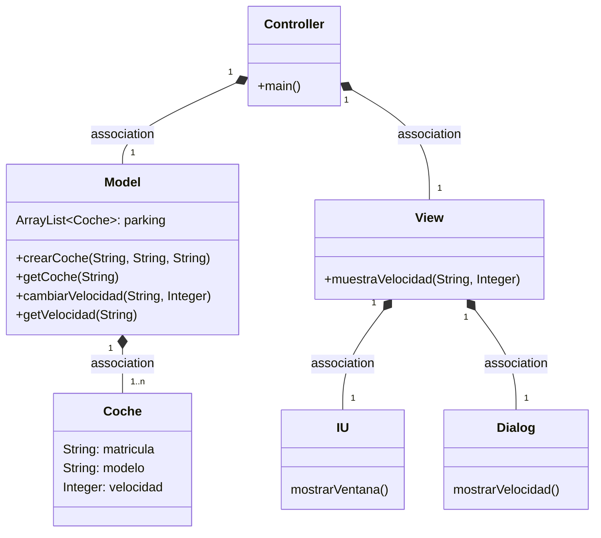
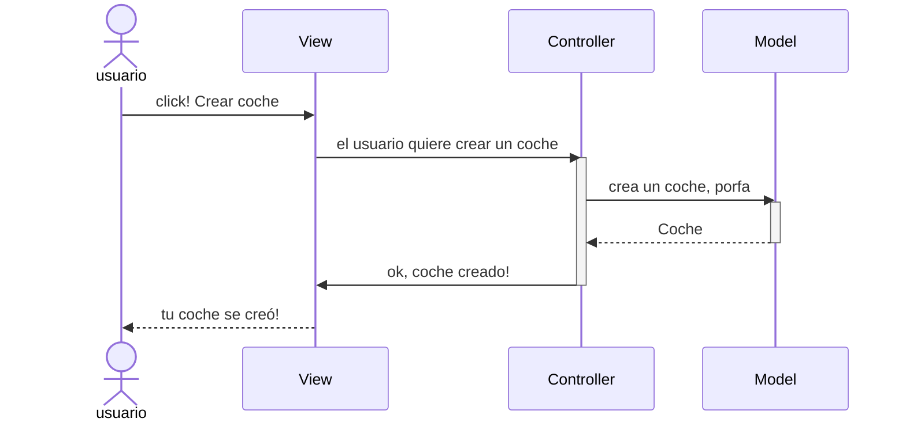
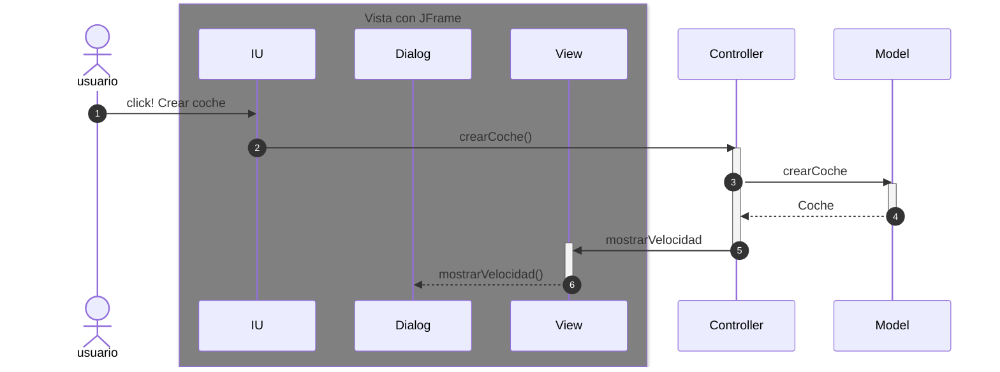

# Arquitectura MVC

Aplicación que trabaja con objetos coches, modifica la velocidad y la muestra

---
## Diagrama de clases:

---

## Evento en el View

Cuando ocurre un evento en la vista, el `controller` se tiene que enterar.
Tenemos que tener en cuenta que en el MVC estricto, la vista no se comunica con el modelo.

En el listener del botón llamamos al `controller`

Ahora la parte de la Arquitectura de la vista, son tres clases

---
## Examen e pasos que realicei;

1. Creo a clase ObsExceso:
    + Nesta clase implemento o Observer 
    + Despois instancio a View e o metodo update cun if para cando
    cambie de velocidade poña un mensaxe sobre esa velocidade, no caso de if si a velocidade pasa dos
    120 mostra o mensaxe que esta na View como mostrarExceso, e no caso de else o mensaje normal notificando 
    a velocidade
2. No Model:
   + Primeiro extendemos Observable, logo nos metodos subir e baixar velocidade instancio a clase Coche
    logo facemos un if onde si o coche existe, no caso do metodo subirVelocidade a velocidade aumente, 
    e no caso do metodo bajarVelocidad a velocidade baixa, despois en ambos casos e igual cos metodos 
    setChanged e notifyObservers(coche), para que notifique sobre o cambio realizado na velocidade.
3. No Controller:
   + Instancio a clase ObsExceso e añado o Observer ao Observable
4. Na View:
    + Creo o metodo mostrarExceso para que mandar o mensaxe

