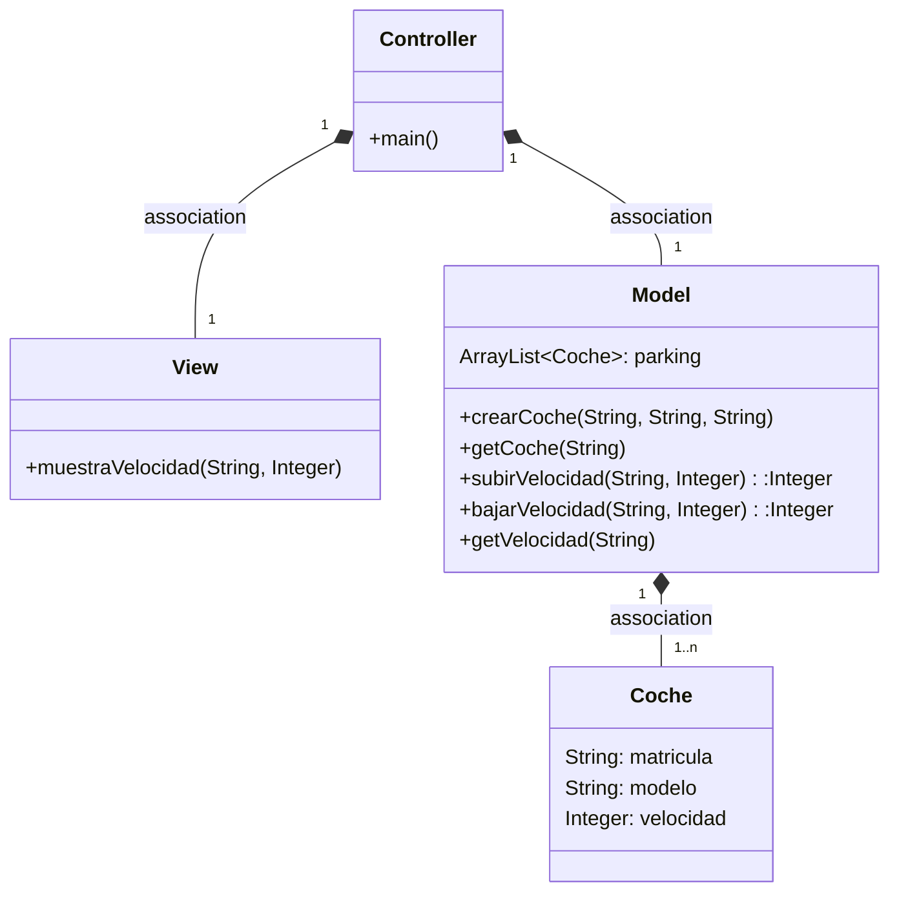
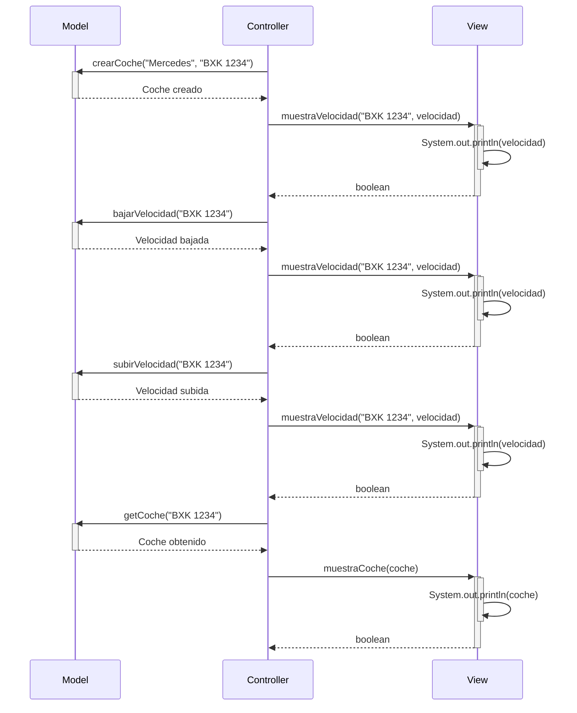

# EXAMEN 3RA EVALUACION

### Enunciado

El exámen tienes que hacerlo en una rama (nombre de la rama ex3) de tu proyecto de MVC coches. En el que tienes que tener implementado subir/bajar velocidad.

Implementa la funcionalidad de buscar un coche dado de alta y mostrar sus datos, incluyendo la velocidad. Respeta la arquitectura MVC

    -Crea un issue exponiendo la funcionalidad
    -Realiza las modificaciones
    -Crea un pull Request para la rama principal
    -Mientras codificas, documenta

#### Pasos

    1- He creado un Issue en Github donde propongo el cambio del nuevo método getCoche()

    2- Implemento esta motificación añadiendo un nuevo boton llamado getCoche() y llamando desde el Listener
            al método getCoche del controller
        Este mismo método en el controller, llama al método getCoche del Model y al método mosrar coche de vista

    3- Desde esta rama creo un pull request a la rama principal

    4- realizo un javaDoc de estas modificaciones

---
## Diagrama de clases:

---

## Diagrama de Secuencia

Aquí se muestra el diagrama de secuencia en el cual añadimos el método de getCoche()

