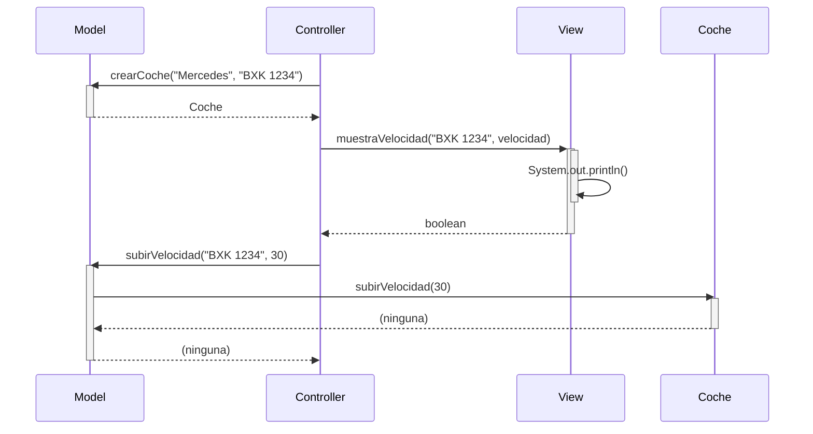

#Proyecto MVC Coches
¡Bienvenido/a al proyecto MVC Coches! En este proyecto he implementado una arquitectura Modelo-Vista-Controlador (MVC) para administrar coches y sus velocidades.

#Funcionalidades implementadas
Subir y bajar velocidad
He añadido la funcionalidad de subir y bajar la velocidad de los coches. Cada coche tiene un modelo, una matrícula y una velocidad asociada. Utilizando la lógica del controlador, ahora puedo aumentar o disminuir la velocidad de un coche específico en incrementos dados.

#Búsqueda de coche y visualización de datos
También he implementado la capacidad de buscar un coche dado de alta y mostrar sus datos completos, incluyendo la velocidad. A través del modelo, puedo buscar un coche por su matrícula y, si se encuentra, obtener su información completa y mostrarla en la vista correspondiente.

# Arquitectura MVC

Aplicación que trabaja con objetos coches, modifica la velocidad y la muestra

---
## Diagrama de clases:

```mermaid
classDiagram
    class Coche {
        String: matricula
        String: modelo
        Integer: velocidad
        +subirVelocidad(Integer)
        +bajarVelocidad(Integer)
        +getVelocidad() : Integer
    }
    class Controller {
        +main()
    }
    class View {
        +muestraVelocidad(String, Integer)
    }
    class Model {
        ArrayList<Coche>: parking
        +crearCoche(String, String) : Coche
        +getCoche(String) : Coche
        +subirVelocidad(String, Integer)
        +bajarVelocidad(String, Integer)
    }
    Controller "1" *-- "1" Model : association
    Controller "1" *-- "1" View : association
    Model "1" *-- "1..n" Coche : association

```

---

## Diagrama de Secuencia

Ejemplo básico del procedimiento, sin utilizar los nombres de los métodos

El mismo diagrama con los nombres de los métodos

