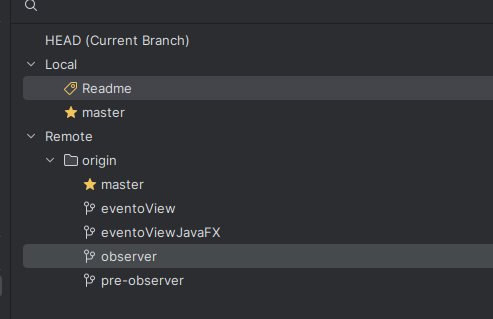
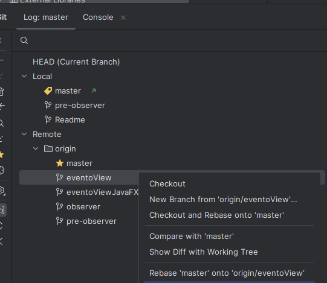
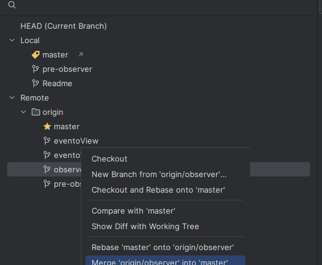

# EXAMEN RAMAS - PIERO LÓPEZ ROSAS

## Fork al repositorio dado

## Creamos la rama README

# Merge de la rama `eventoView`
* Hacemos `checkout` en la rama `master`
* Con click derecho en la rama `eventoView` seleccionamos la opcion de realizar un merge   
  
* Si lo hacemos asi ya se habran "fusionado las ramas"

# Merge de la rama `observer`
* Hacemos `checkout` en la rama `master`
* Con click derecho en la rama `observer` seleccionamos la opcion de realizar un merge   
  
* Si lo hacemos asi ya se habran "fusionado las ramas"
