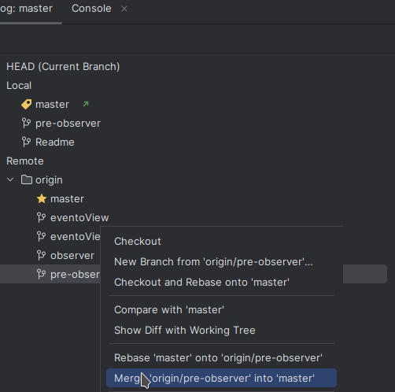
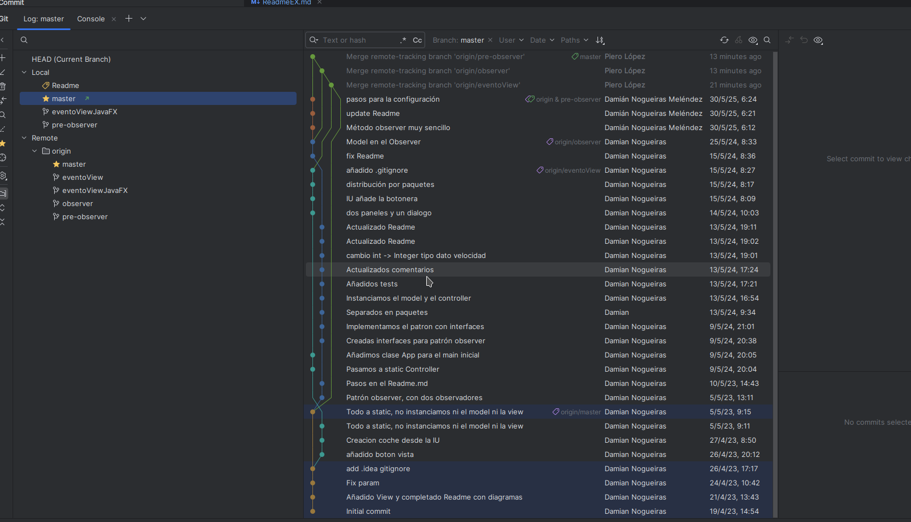
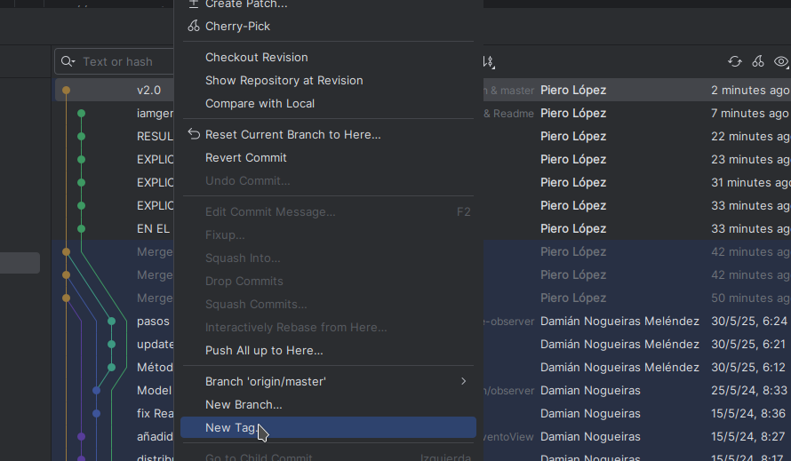

# EXAMEN RAMAS - PIERO LÓPEZ ROSAS

## Fork al repositorio dado

## Creamos la rama README

# Merge de la rama `eventoView`
* Hacemos `checkout` en la rama `master`
* Con click derecho en la rama `eventoView` seleccionamos la opcion de realizar un merge   
  
* Si lo hacemos asi ya se habran "fusionado las ramas"

# Merge de la rama `observer`
* Hacemos `checkout` en la rama `master`
* Con click derecho en la rama `observer` seleccionamos la opcion de realizar un merge   
  
* Si lo hacemos asi ya se habran "fusionado las ramas"

# Merge de la rama `pre-observer`
* Hacemos `checkout` en la rama `master`
* Con click derecho en la rama `pre-observer` seleccionamos la opcion de realizar un merge   
  
* Si lo hacemos asi ya se habran "fusionado las ramas"

# Resultado final rama `master`

# RELEASE

* Para finalizar, una vez todo este listo creamos un `commit` para marcar la Release v2.0
  
* Ve a tu repositorio en GitHub, haz clic en la pestaña "Releases", luego en "Draft a new release", selecciona la etiqueta v1.0 en "Tag version" y escribe como título Release v2.0.
  